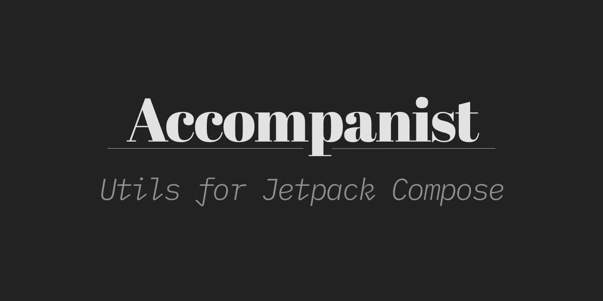

Accompanist is a group of libraries that aim to supplement [Jetpack Compose][compose] with features that are commonly required by developers but not yet available.

Accompanist is a labs like environment for new Compose APIs. We use it to help fill known gaps in the Compose toolkit, experiment with new APIs and to gather insight into the development experience of developing a Compose library. The goal of these libraries is to upstream them into the official toolkit, at which point they will be deprecated and removed from Accompanist.

For more details like, why does this library exist? Why is it not part of AndroidX? Will you be releasing more libraries? Check out our [Accompanist FAQ](https://medium.com/p/b55117b02712).

## Compose versions

Each [release](https://github.com/google/accompanist/releases) outlines what version of the Compose UI libraries it depends on. We are currently releasing multiple versions of Accompanist for the different versions of Compose:

<table>
 <tr>
  <td>Compose 1.0 (1.0.x)</td><td></td>
 </tr>
 <tr>
  <td>Compose 1.1 (1.1.x)</td><td></td>
 </tr>
 <tr>
  <td>Compose UI 1.2 (1.2.x)</td><td></td>
 </tr>
 <tr>
  <td>Compose UI 1.3 (1.3.x)</td><td></td>
 </tr>
 <tr>
  <td>Compose UI 1.4 (1.4.x)</td><td></td>
 </tr>
 <tr>
  <td>Compose UI 1.5 (1.5.x)</td><td></td>
 </tr>
 <tr>
  <td>Compose UI 1.6 (1.6.x)</td><td></td>
 </tr>
  <tr>
  <td>Compose UI 1.7 & 1.8 (1.7.x)</td><td></td>
 </tr>
</table>

For stable versions of Compose, we use the latest *stable* version of the Compose compiler. For non-stable versions (alpha, beta, etc), we use the latest compiler at the time of release.

> :warning: **Ensure you are using the Accompanist version that matches with your Compose UI version**: If you upgrade Accompanist, it will upgrade your Compose libraries version via transitive dependencies.

## Libraries

### 📫 [Permissions](./permissions/)
A library that provides [Android runtime permissions][runtimepermissions] support for Jetpack Compose.

### 🖌️ [Drawable Painter](./drawablepainter/)
A library which provides a way to use Android Drawables as Jetpack Compose Painters.

### 📜 [Adaptive](./adaptive/)
A library providing a collection of utilities for adaptive layouts.

### 🧭✨[Navigation-Animation](./navigation-animation/) (Deprecated & Removed)
See our [Migration Guide](https://google.github.io/accompanist/navigation-animation/) for migrating to using built in support for animations in Jetpack Navigation Compose. 

### 🧭🎨️ [Navigation-Material](./navigation-material/) (Deprecated & Removed)
See our [Migration Guide](https://google.github.io/accompanist/navigation-material/) for migrating to using built in material-navigation support. 

### 🍫 [System UI Controller](./systemuicontroller/) (Deprecated & Removed)
We recommend migrating to edge to edge. See our [Migration Guide](https://google.github.io/accompanist/systemuicontroller/) for more details.

---

## Future?

Any of the features available in this group of libraries may become obsolete in the future, at which point they will (probably) become deprecated. 

We will aim to provide a migration path (where possible), to whatever supersedes the functionality.

## Snapshots

Snapshots of the current development version of Accompanist are available, which track the latest commit. See [here](docs/using-snapshot-version.md) for more information. 

---

### Why the name?

The library is all about adding some utilities around Compose. Music composing is done by a
composer, and since this library is about supporting composition, the supporting role of an [accompanist](https://en.wikipedia.org/wiki/Accompaniment) felt like a good name.

## Contributions

Please contribute! We will gladly review any pull requests.
Make sure to read the [Contributing](CONTRIBUTING.md) page first though.

## License

```
Copyright 2020 The Android Open Source Project
 
Licensed under the Apache License, Version 2.0 (the "License");
you may not use this file except in compliance with the License.
You may obtain a copy of the License at

    https://www.apache.org/licenses/LICENSE-2.0

Unless required by applicable law or agreed to in writing, software
distributed under the License is distributed on an "AS IS" BASIS,
WITHOUT WARRANTIES OR CONDITIONS OF ANY KIND, either express or implied.
See the License for the specific language governing permissions and
limitations under the License.
```

[appcompat]: https://developer.android.com/jetpack/androidx/releases/appcompat
[compose]: https://developer.android.com/jetpack/compose
[snap]: https://oss.sonatype.org/content/repositories/snapshots/com/google/accompanist/
[mdc]: https://github.com/material-components/material-components-android
[windowinsets]: https://developer.android.com/reference/kotlin/android/view/WindowInsets
[viewpager]: https://developer.android.com/reference/kotlin/androidx/viewpager/widget/ViewPager
[runtimepermissions]: https://developer.android.com/guide/topics/permissions/overview
