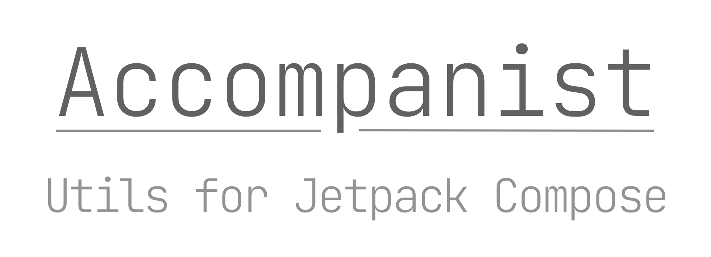

Accompanist is a group of libraries which contains some utilities which I've found myself copying around projects which use [Jetpack Compose][compose]. Currently it contains:

 * 🎨 [Material Design Components theme integration](./mdc-theme/README.md)
 * 🖼️ [Coil image loading composables](./coil/README.md)

[Jetpack Compose][compose] is a fast moving project and I'll be updating these libraries to match the
latest tagged release as quickly as possible. Each [release listing](https://github.com/chrisbanes/accompanist/releases) will outline what version of Compose and the UI libraries it depends on.

## Download

```groovy
repositories {
    mavenCentral()
}

dependencies {
    implementation "dev.chrisbanes.accompanist:accompanist-mdc-theme:<version>"
    implementation "dev.chrisbanes.accompanist:accompanist-coil:<version>"
}
```

### Accompanist Snapshots

Snapshots of the current development version of Accompanist are available, which track the latest commit.

<details><summary><strong>Snapshot repository instructions</strong></summary>

The snapshots are deployed to Sonatype's `snapshots` [repository][snap]:

```groovy
repositories {
    // ...
    maven { url 'https://oss.sonatype.org/content/repositories/snapshots' }
}

dependencies {
    // Check the latest SNAPSHOT version from the link above
    classpath 'dev.chrisbanes.accompanist:accompanist-mdc-theme:vXXX-SNAPSHOT'
    classpath 'dev.chrisbanes.accompanist:accompanist-coil:vXXX-SNAPSHOT'
}
```

You might see a number of different versioned snapshots. If we use an example:

* `0.1.5-SNAPSHOT` is a build from the `main` branch, and depends on the latest tagged Jetpack Compose release (i.e. [dev12](https://developer.android.com/jetpack/androidx/releases/ui#0.1.0-dev12)).
* `0.1.5.ui-6574163-SNAPSHOT` is a build from the `snapshot` branch. This depends on the [SNAPSHOT build](https://androidx.dev) of Jetpack Compose from build 6574163. You should only use these if you are using Jetpack Compose snapshot versions (see below).

</details>

### Using Jetpack Compose Snapshots

If you're using [`SNAPSHOT`](https://androidx.dev) versions of the `androidx.ui`
or `androidx.compose` libraries, you might run into issues with the Accompanist dependency forcing an older version of those libraries.

<details><summary><strong>Jetpack Compose snapshot instructions</strong></summary>

I do publish snapshot versions of Accompanist which depend on recent Jetpack Compose SNAPSHOT repositories. To find a recent build, look through the [snapshot repository][snap] for any versions in the scheme `x.x.x.ui-YYYY-SNAPSHOT` (for example: `0.1.5.ui-6574163-SNAPSHOT`). The `YYYY` in the scheme is the snapshot build being used from [AndroidX](https://androidx.dev) (from the example: build [`6574163`](https://androidx.dev/snapshots/builds/6574163/artifacts)). You can then use the steps above to setup the Accompanist snapshot repositories.

I update these builds regularly, but there's no guarantee that I will create one for a given build number.

</details>

---

#### Why the name?

The library is all about adding some utilities around Compose. Music composing is done by a
composer, and since this library is about supporting composition, the supporting role of an [accompanist](https://en.wikipedia.org/wiki/Accompaniment) felt like a good name.

## Contributions

Please contribute! We will gladly review any pull requests.
Make sure to read the [Contributing](CONTRIBUTING.md) page first though.

## License

```
Copyright 2020 The Android Open Source Project
 
Licensed under the Apache License, Version 2.0 (the "License");
you may not use this file except in compliance with the License.
You may obtain a copy of the License at

    https://www.apache.org/licenses/LICENSE-2.0

Unless required by applicable law or agreed to in writing, software
distributed under the License is distributed on an "AS IS" BASIS,
WITHOUT WARRANTIES OR CONDITIONS OF ANY KIND, either express or implied.
See the License for the specific language governing permissions and
limitations under the License.
```

[compose]: https://developer.android.com/jetpack/compose
[snap]: https://oss.sonatype.org/content/repositories/snapshots/dev/chrisbanes/accompanist/
[mdc]: https://material.io/develop/android/
